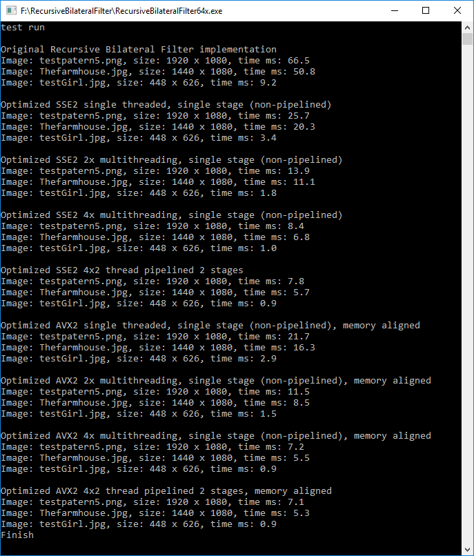

# Optimized Recursive Bilateral Filter

This project is a derivative work based on this project:
https://github.com/ufoym/RecursiveBF

The main purpose of this project is to provide a more optimized implementation of the Recursive Bilateral Filter. For more information about the image filter, see the link above

Optimization is based on 3 categories: reducing memory usage, adding multithreading, adding SSE2 / AVX2 C++ intrinsics

* Memory usage: in original implementation, memory usage of RGB32 or RGBA image would be roughtly = width * height * 40 + width * 40. In optimized implemention, it is roughly = width * height * 4 + width * 80 for non-piplined version. And width * height * 12 + width * 80 for pipelined. In general, almost 10x less memory allocation

* Multithreading: original implementation is written as single threaded solution, and in a way that it not easy split into threads. Optimized solution is multithread friendly because it separates the filter into 2 stages, one for horizontal filter pass, other for vertical filter pass. Each filter pass can then be subdivided into user chosen number of threads. For horizontal filter, each thread handles its own row from original data buffer, while for vertical pass, each thread handles its own column block

* SSE2 and AVX2: original implementation is written in basic C++ and while it is possible to select SSE2 or AVX2 optimization guidelines in compiler, the generated code does not properly take advantage of that functionality. Optimized solution provides 2 separate implementations, one written almost exclusively with SSE2 intrinsics, another almost exclusively with AVX2 intrinsics, so the compiler can utilize their capabilities much more effectively.

It's important to mention that this optimized implementation has some fundamental differences with the original. Those are:

*) Only images with 4 bytes per pixel are accepted, this means RGB32 or RGBA. With some light modifications, it would be possible to adapt it to work with RGB24, single channel, or YUV 422 (2 pixels in 4 bytes)

*) Edge detection algorithm is different. In original version, 3 components (RBG) of 2 adjacent pixels are evaluated for absolute difference, then 2 of those absolute differences are divided by 4 and added together, 3rd component is divided by 2 and added to the sum. The goal is to get absolute difference between 2 pixels in 0-255 range, but this solution makes one of the components have 2x significance of other 2. Optimized solution offers 2 alternative options (chosen which compiler flag): either get maximum of absolute differences between 3 components (stronger blur) or get 255 saturated sum of absolute differences of 3 components (weaker blur). Both methods have equal cost. The value of 4th component (alpha) is not taken into account, but it would be easy to do so if needed

*) Sigma Spatial: in original implementation, sigma spatial, one of the 2 blur parameters, has depedency on image width and height. That means the same value would yield different amount of blur based on size of the image. Optimized solution removes that dependency by anchoring sigma spatiel to arbitrary value of 255, making it uniform for both width and height.

For testing purposes, 3 images were chosen: 

* testGirl.jpg - smallest image, 448 x 626, it is the same image used in original implementation 
* Thefarmhouse.jpg - larger image, 1440 x 1080, it is a painting with lots of small noise that can be blurred. 
* testpatern5.png - full HD image, 1920 x 1080, it is a test pattern that has no noise and sharp edges. It is useful for purpose of verifying that edge preserving image filter has minimum impact on the edges

Here's what built 64 bit application output looks like on Intel i7-4700HQ (~2.4 GHz):

Image paths and blur strength (sigma) values are hardcoded, at top of RecursiveBilateralFilter.cpp
When application runs, it saves filtered image under generated name in same folder as original images
